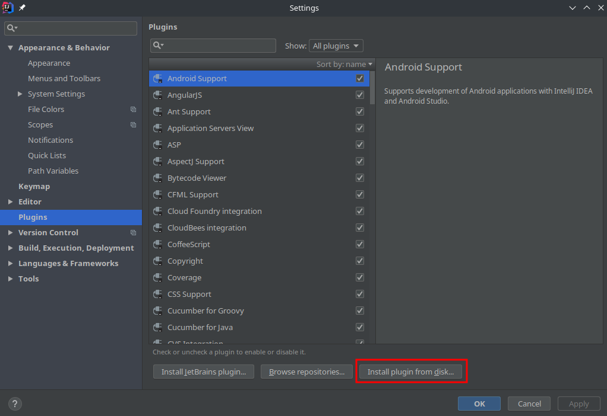

## JetBrains Issues and Resolutions on Kubuntu
There were certain things that required a certain amount of consideration/configuration. Things that haven't been an issue on other distros
seemed to have been an issue here, at least with IntelliJ Ultimate 2018.2.

### Getting JetBrains IDE Running on Kubuntu
JetBrains IntelliJ was unable to run out-of-the-box. After installing `IntelliJ Ultimate 2018.2` on `Kubuntu 22.04` it
would lock up whenever trying to open a file for editing.

Further details on the error and the resolution were found on the JetBrains Forum. The Issue ticket can be found 
[here](https://youtrack.jetbrains.com/issue/JBR-1366/IntelliJ-Ultimate-unusable-on-fresh-install-of-Ubuntu-1810-due-to-missing-dependencies).

##### Exception
```bash
$ ./idea.sh 
Graphics Device initialization failed for :  es2, sw
Error initializing QuantumRenderer: no suitable pipeline found
java.lang.RuntimeException: java.lang.RuntimeException: Error initializing QuantumRenderer: no suitable pipeline found
        at com.sun.javafx.tk.quantum.QuantumRenderer.getInstance(QuantumRenderer.java:280)
        at com.sun.javafx.tk.quantum.QuantumToolkit.init(QuantumToolkit.java:221)
        at com.sun.javafx.tk.Toolkit.getToolkit(Toolkit.java:248)
        at com.sun.javafx.application.PlatformImpl.startup(PlatformImpl.java:209)
        at com.intellij.ui.javafx.JavaFxHtmlPanel.lambda$null$4(JavaFxHtmlPanel.java:36)
        at sun.awt.SunToolkit.unsafeNonblockingExecute(SunToolkit.java:644)
        at sun.reflect.NativeMethodAccessorImpl.invoke0(Native Method)
        at sun.reflect.NativeMethodAccessorImpl.invoke(NativeMethodAccessorImpl.java:62)
        at sun.reflect.DelegatingMethodAccessorImpl.invoke(DelegatingMethodAccessorImpl.java:43)
        at java.lang.reflect.Method.invoke(Method.java:498)
        at com.intellij.ide.IdeEventQueue.unsafeNonblockingExecute(IdeEventQueue.java:1420)
        at com.intellij.ui.javafx.JavaFxHtmlPanel.runFX(JavaFxHtmlPanel.java:67)
        at com.intellij.ui.javafx.JavaFxHtmlPanel.lambda$new$5(JavaFxHtmlPanel.java:36)
        at com.intellij.openapi.application.TransactionGuardImpl$2.run(TransactionGuardImpl.java:315)
        at com.intellij.openapi.application.impl.LaterInvocator$FlushQueue.doRun(LaterInvocator.java:447)
        at com.intellij.openapi.application.impl.LaterInvocator$FlushQueue.runNextEvent(LaterInvocator.java:431)
        at com.intellij.openapi.application.impl.LaterInvocator$FlushQueue.run(LaterInvocator.java:415)
        at java.awt.event.InvocationEvent.dispatch(InvocationEvent.java:311)
        at java.awt.EventQueue.dispatchEventImpl(EventQueue.java:762)
        at java.awt.EventQueue.access$500(EventQueue.java:98)
        at java.awt.EventQueue$3.run(EventQueue.java:715)
        at java.awt.EventQueue$3.run(EventQueue.java:709)
        at java.security.AccessController.doPrivileged(Native Method)
        at java.security.ProtectionDomain$JavaSecurityAccessImpl.doIntersectionPrivilege(ProtectionDomain.java:80)
        at java.awt.EventQueue.dispatchEvent(EventQueue.java:732)
        at com.intellij.ide.IdeEventQueue.defaultDispatchEvent(IdeEventQueue.java:781)
        at com.intellij.ide.IdeEventQueue._dispatchEvent(IdeEventQueue.java:722)
        at com.intellij.ide.IdeEventQueue.dispatchEvent(IdeEventQueue.java:382)
        at java.awt.EventDispatchThread.pumpOneEventForFilters(EventDispatchThread.java:201)
        at java.awt.EventDispatchThread.pumpEventsForFilter(EventDispatchThread.java:116)
        at java.awt.EventDispatchThread.pumpEventsForHierarchy(EventDispatchThread.java:105)
        at java.awt.EventDispatchThread.pumpEvents(EventDispatchThread.java:101)
        at java.awt.EventDispatchThread.pumpEvents(EventDispatchThread.java:93)
        at java.awt.EventDispatchThread.run(EventDispatchThread.java:82)
Caused by: java.lang.RuntimeException: Error initializing QuantumRenderer: no suitable pipeline found
        at com.sun.javafx.tk.quantum.QuantumRenderer$PipelineRunnable.init(QuantumRenderer.java:94)
        at com.sun.javafx.tk.quantum.QuantumRenderer$PipelineRunnable.run(QuantumRenderer.java:124)
        at java.lang.Thread.run(Thread.java:745)
```

##### Resolution
This was resolved by adding a dependency that was missing by default, the `openjfx` package.

```bash
sudo apt install openjfx
```

### Getting a working Markdown Viewer
This has worked on other platforms, but on Kubuntu the Markdown Viewer in IntelliJ was not working properl, espescially with things like images.
 
##### Issue
This appears to be a known issue with certain versions of IntelliJ, supposedly fixed in `Version 2019.2`, which is not an option. Details on the known
issue can be found in this [ticket](https://intellij-support.jetbrains.com/hc/en-us/community/posts/360004416679-Markup-plugin-does-not-show-images).

This can be identified by seeing improperly rendered pages when switching to the Markdown viewer. This was easily/especially noticeable when it came to
links and images.

##### Resolution
The resolution was to obtain a third-party Markdown Plug-in. This replaces the default Jet Brains Plug-in. It is pretty nice overall, and has more options.
Luckily, this Plug-in was developed and maintained in the era of `Version 2018.2`. The Plug-in is called [Markdown Navigator Enhanced](https://plugins.jetbrains.com/plugin/7896-markdown-navigator-enhanced).

The version of Markdown Navigator Enhanced to download for `IntelliJ Ultimate 2018.2` is Version [2.9.0](https://plugins.jetbrains.com/plugin/7896-markdown-navigator-enhanced/versions/stable/66558).
Download the Plug-in Archive. No need to unpack it.

###### Install the Third-Party Plug-in on IntelliJ Ultimate.
* Navigate to `File -> Settings...`
  * Click the `Plugins` sub-menu
     * Click the `Install Plugin from disk...` Button
     * 
     * Select the Markdown Navigator Enhanced Plugin that was just downloaded to Import
  * You will need to restart IntelliJ for the update to take effect.
* When/if prompted, select the new Markdown Plug-in that was just installed as the Default Plug-in for Markdown files.